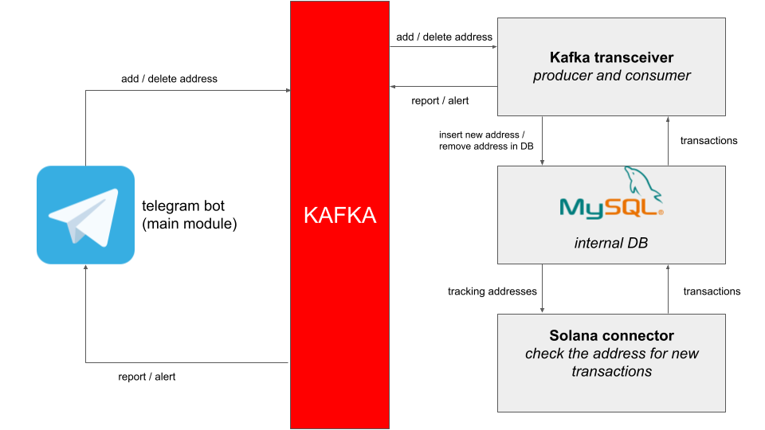

# Btrace - main module

## What is it?

*Btrace* is a detective bot for tracking transactions and addresses.

The main module is a "composer" of all blockchain connectors and a telegram bot that sends information about a new transaction.

## How does it work?

For expample: main module + solana connector



1. The main module receives a new address from the user
2. The main module sends the address to the kafka topic "SOL_TO_CHECKER". See `database/models.py` - Blockchain class.
3. The blockchain connector (microservice) gets the new address via the kafka topic and starts the track.
4. If the tracker finds a new transaction, it sends the transaction via the kafka "SOL" topic.
5. The main module consumes the "SOL" topic. If it receives a new transaction, the telegram bot forms a new message with information about the transaction.

## Install

1. YOU ARE REQUIRED TO CREATE A FILE **config.json**

> Sample structure
```json
{
    "databases": {
      "tracer": {
        "dialect": "mysql",
        "sync_driver": "SOME_SYNC_DRIVER",
        "async_driver": "SOME_ASYNC_DRIVER",
        "user": "USER",
        "password": "PASS",
        "host": "HOST",
        "port": 3306,
        "name": "tracer"
      },
    },
    "TOKEN": "telegram bot token",
    "kafka": "kafka host"
}
```
> **Tracer** - internal database for the correct work of the main module.

2. Create tracer DB

> The docker-compose.yml was created to make things easier. You can create a docker container with the base. *Use your logins and passwords!*

3. Create tables in DB.

> Check `database/models.py`.

4. Create python virtual environments

> The bot requires its own virtual environments - NAME it `env`.

5. Change btracer.service

> Change **user** and **group**. Pay attention to the working directory. If the repository is in a different folder ALSO CHANGE **WorkingDirectory**, **Environment**, **ExecStart**

6. Run `script.sh`

```
sudo ./srcipt.sh
```